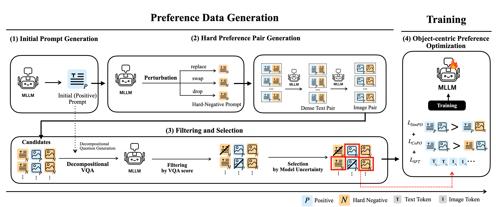

# OSPO
Official implementation of "OSPO: Object-centric Self-improving Preference Optimization for Text-to-Image Generation"
<h1 align="center">OSPO</h1>

<p align="center">
  <a href="https://arxiv.org/abs/2506.02015">
    
  </a>
  <a href="https://huggingface.co/KU-AGILab/OSPO-Janus-Pro-7B">
    
  </a>
  <a href="https://huggingface.co/datasets/KU-AGILab/OSPO-Janus-Pro-7B-iter1">
    
  </a>
</p>

<p align="center">
This repository contains the official implementation for the paper</br><b>"OSPO: Object-centric Self-improving Preference Optimization for Text-to-Image Generation."</b>
</p>



## 0. About
**OSPO** is a self-improving prefernece optimization framework for compositional text-to-image generation, allowing an MLLM to improve its fine-grained image generation capability without needing any data or external model. 

### TODO
- [x] Release the model checkpoint.
- [x] Release the training dataset.
- [x] Release the inference code for text-to-image generation.
- [x] Rlease the OSPO framework code.
- [x] Release the evaluation code.
- [ ] Release the Unitok version code.
- [ ] Release example data for each step.

## 1. Setup
1. Create Conda Environment
<!-- ```bash
conda create -n ospo python=3.8 -y
conda activate ospo
``` -->
```bash
conda create -n ospo python=3.10 -y
conda activate ospo
```

2. Clone this repository
```bash
git clone https://github.com/KU-AGI/OSPO.git
cd OSPO
```

3. Install Dependencies
<!-- ```bash
# We use pytorch 2.0.1 CUDA 11.7 Version
conda install pytorch==2.0.1 torchvision==0.15.2 torchaudio==2.0.2 pytorch-cuda=11.7 -c pytorch -c nvidia

# Install Dependencies
pip install -r requirements.txt
``` -->
```bash
conda install pytorch==2.2.1 torchvision==0.17.1 torchaudio==2.2.1 pytorch-cuda=12.1 -c pytorch -c nvidia

# Install Dependencies
pip install -r requirements.txt
```

4. Download Janus-Pro-7B Model (baseline) from [🤗 HuggingFace](https://huggingface.co/deepseek-ai/Janus-Pro-7B)
- Create `./checkpoints` directory and place the Model in the `./checkpoints` directory.
- So the Model folder path should be `./checkpoints/Janus-Pro-7B`


## 2. Inference
We provide our different model checkpoints on Hugging Face.
|         Model            |                           Download                           |
| :----------------------- | :----------------------------------------------------------: |
| OSPO + Janus-Pro-7B      |   🤗 [HuggingFace](https://huggingface.co/KU-AGILab/OSPO-Janus-Pro-7B) |
| OSPO + Janus-1.3B        |   🤗 [HuggingFace](https://huggingface.co/KU-AGILab/OSPO-Janus-1B) |
| OSPO + Unitok-MLLM-7B    |   🤗 [HuggingFace](https://huggingface.co/KU-AGILab/OSPO-Unitok-MLLM-7B) |

1. Download the model weights from the table.
2. Place the checkpoint in the `./checkpoints` directory.

<!-- 3. So the checkpoint path should be `./checkpoints/ospo-epoch1.ckpt` -->
<!-- 1. For inference, please download the model weights from the following link: -->
<!-- - Janus-Pro-7B trained by **OSPO** Framework: [Google Drive](https://drive.google.com/file/d/1AI42LfljJ5nl2YZ-AVuD0sziYs0KB_yx/view?usp=sharing)-->

<!-- 3. Run the script.
```bash
bash scripts/run_inference.sh
``` -->
3. Run the code.
```bash
# OSPO + Janus-Pro-7B
python inference_janus.py --input ${INPUT_TEXT}

# OSPO + Unitok-MLLM-7B
python inference_unitok.py --input ${INPUT_TEXT}
```
Results will be saved in `./results`

## 3. Reproduce 
First of all, you can reproduce only the training step using our provided training dataset.  🤗 [HuggingFace](https://huggingface.co/datasets/KU-AGILab/OSPO-Janus-Pro-7B-iter1)
```bash
python ospo/step4.py --cfg_path configs/step4.yaml
```
If you want to reproduce the full OSPO framework, please refer to this [page](https://github.com/KU-AGI/OSPO/blob/main/ospo/README.md).


## 4. Evaluate 
Please refer to this [page](https://github.com/KU-AGI/OSPO/blob/main/eval/README.md).


## 📍 Acknowledgement
We thank the authors of [Janus-Pro](https://github.com/deepseek-ai/Janus?tab=readme-ov-file#janus-pro), [UniTok](https://github.com/FoundationVision/UniTok), [SimPO](https://github.com/princeton-nlp/SimPO) and [mDPO](https://github.com/luka-group/mDPO), for making their code available.

## 📍 Citation
```
@article{oh2025object,
  title={Object-centric Self-improving Preference Optimization for Text-to-Image Generation},
  author={Oh, Yoonjin and Kim, Yongjin and Kim, Hyomin and Chi, Donghwan and Kim, Sungwoong},
  journal={arXiv preprint arXiv:2506.02015},
  year={2025}
}
```
